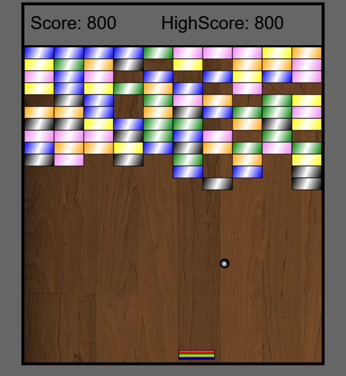
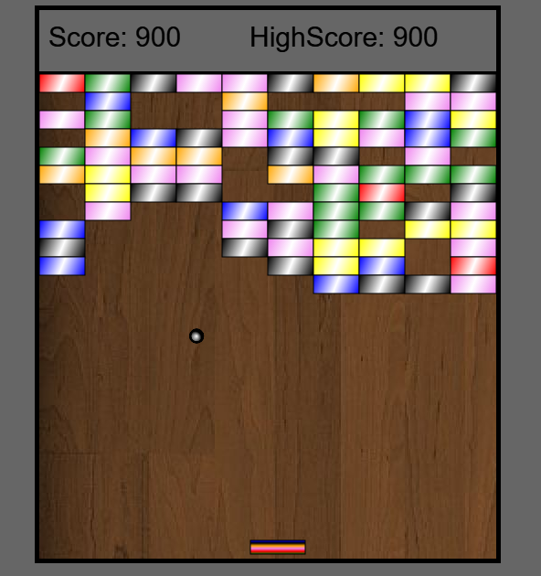
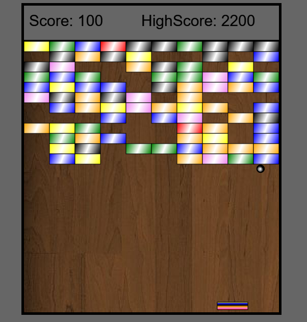

# Breakout

This arcade game is written in javascript.
The objective of the game is to break all the colored bricks to score highest score.
The speed of ball get increased after some intervals of time.

The angle at which ball bounces back from the platform depends on the point where the ball hit the platform.

Platform can be moved using the mouse.

